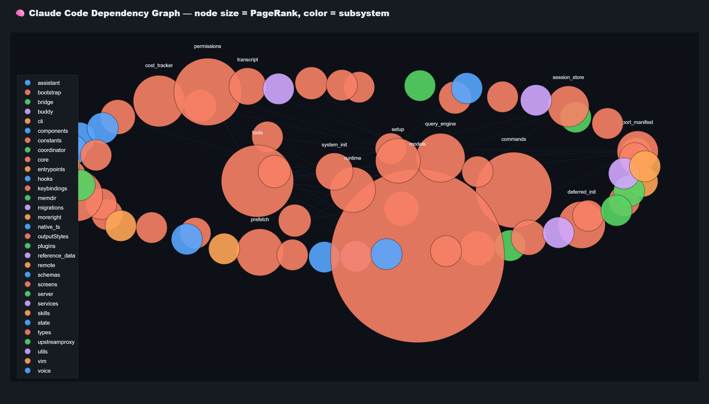
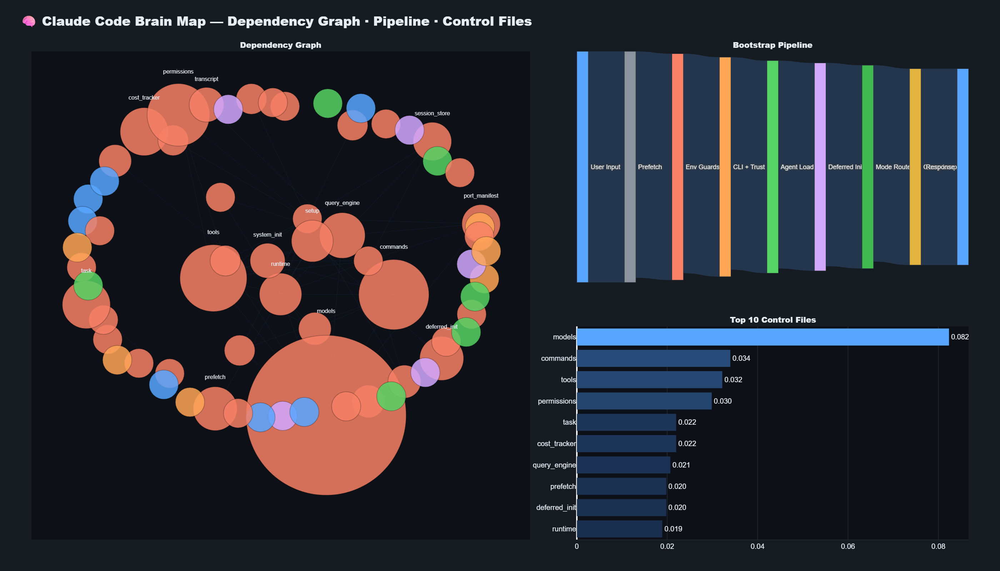
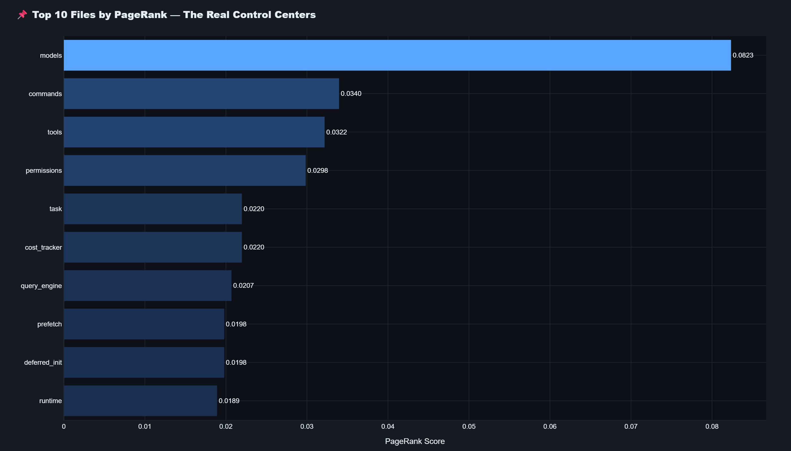
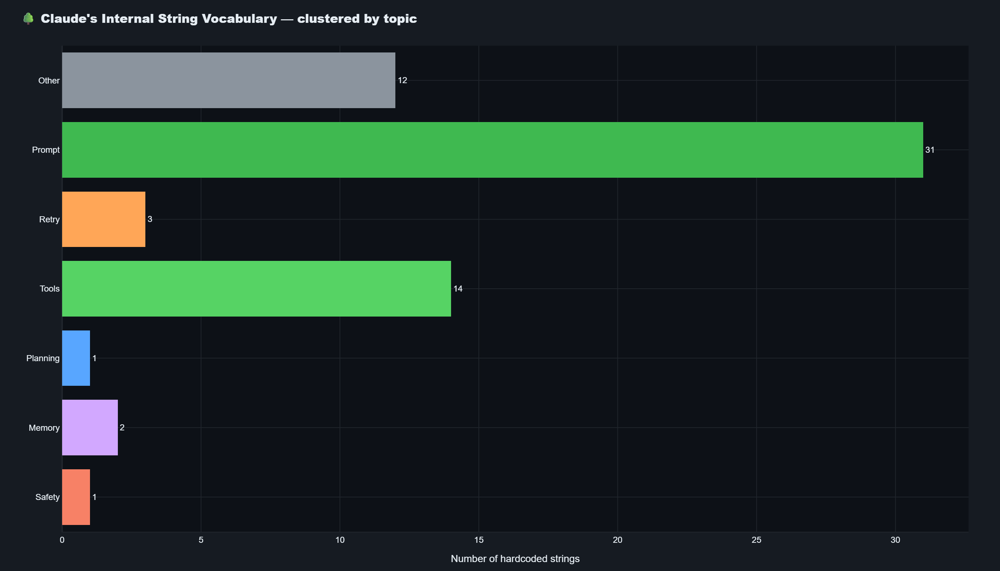
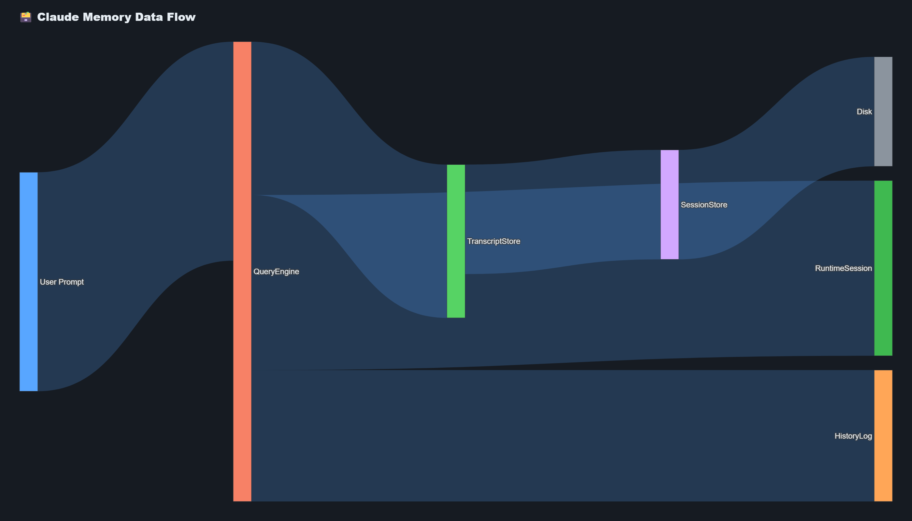
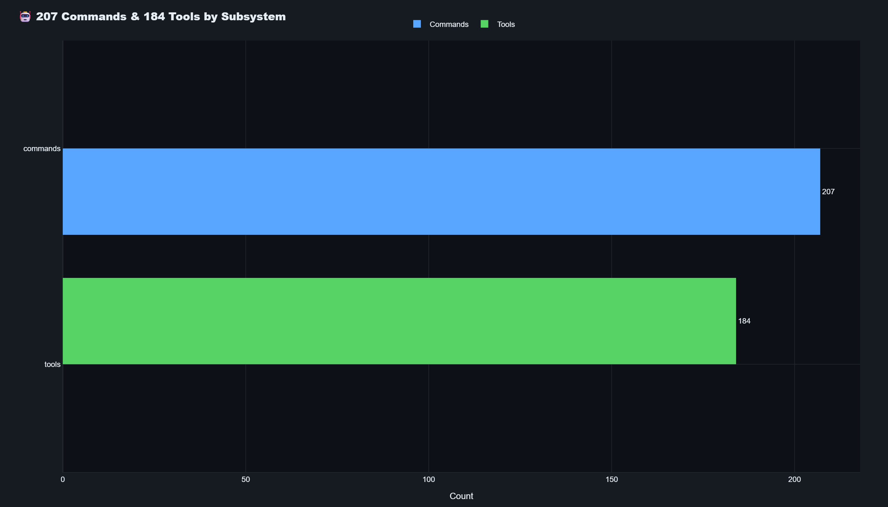
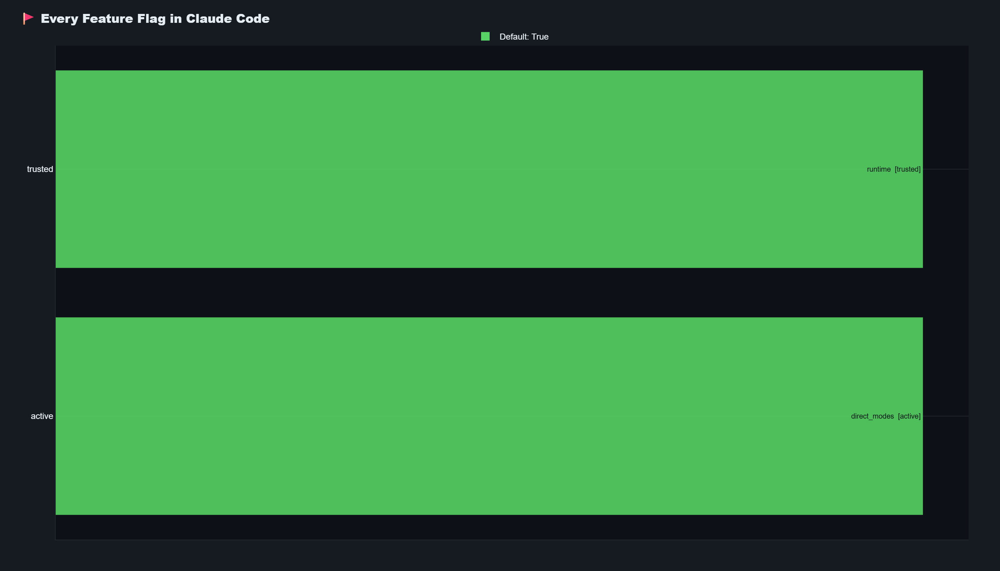
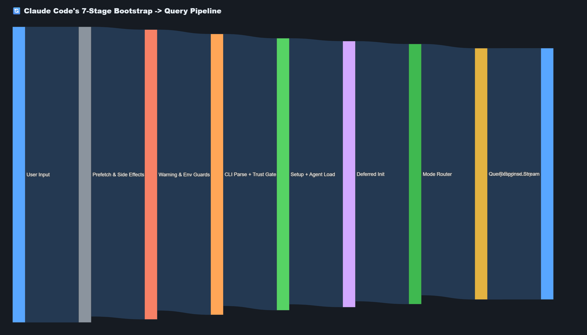
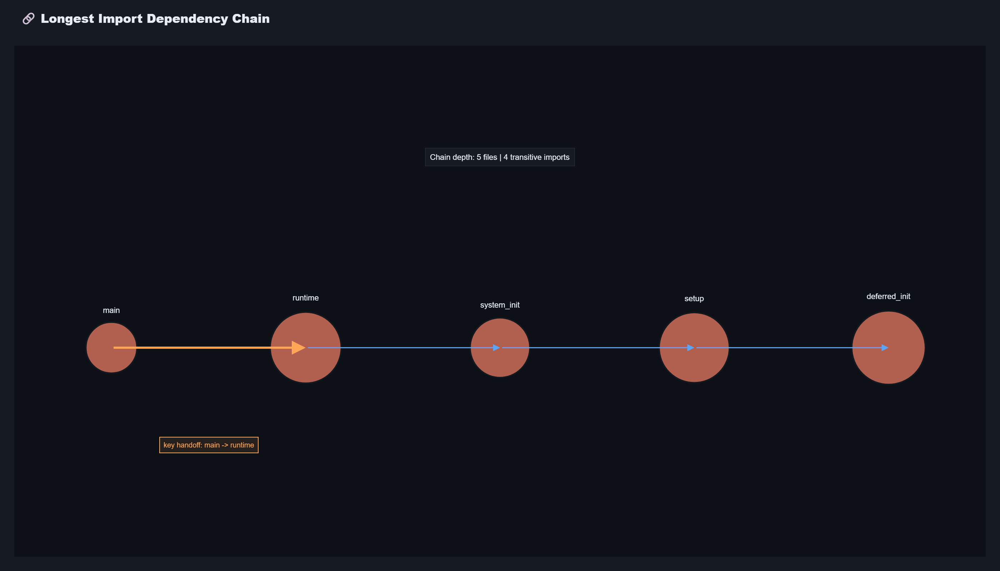
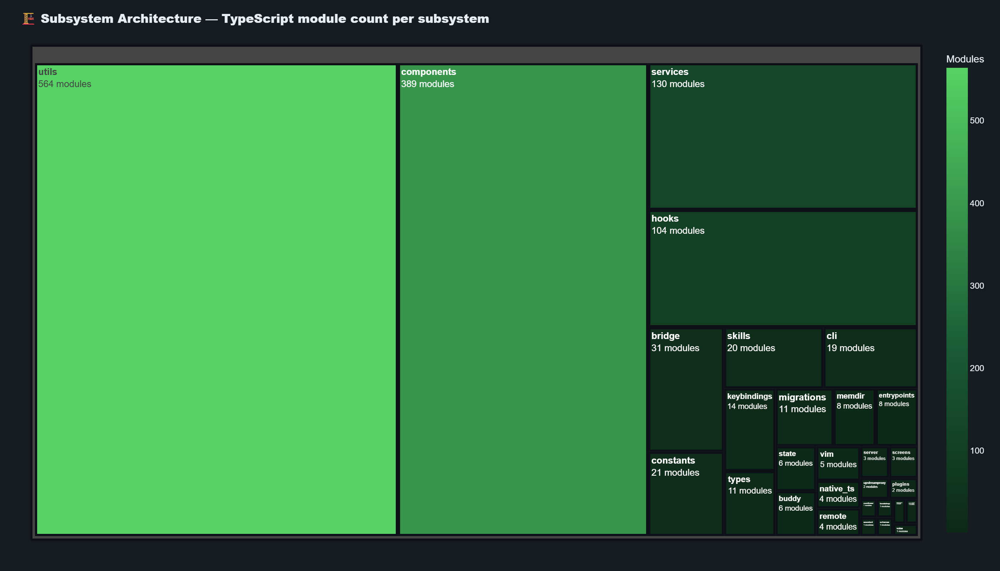

# Claude X-Ray: The Hidden Brain of Claude Code

> **A reverse-engineering analysis of the internal architecture of Claude Code**  
> Powered by [claw-code](https://github.com/instructkr/claw-code) — the open Python port of Claude Code's agent harness

---

## What is This?

Claude Code is Anthropic's official agentic CLI — but its internals are closed source. This notebook dissects the compiled Python port (`claw-code`) with graph theory, AST analysis, and data mining to expose what happens **before the first token is ever generated**.

We parsed:
- **1,902** original TypeScript source files
- **66** compiled Python modules
- **207** slash commands
- **184** registered tools
- **29** subsystems

The result is a full X-ray of Claude Code's architecture, made entirely inspectable with plain Python.

---

## Visualizations

### The Dependency Brain Map
> Nodes sized by PageRank influence. Colors = subsystem clusters. Hover for details.



---

### Hero Overview: Graph + Pipeline + Top-10
> Three-panel composite: dependency graph (left), 7-stage bootstrap pipeline (top-right), top-10 critical files (bottom-right).



---

### Top 10 Most Critical Files (PageRank)
> `query_engine` leads the pack — every request flows through it.



---

### Secret Prompt Tree: Hardcoded String Topics
> 64 string constants ≥ 40 characters extracted from source, clustered by topic.



---

### Memory Flow Architecture
> Session data path from in-memory transcript to disk persistence.



---

### Commands & Tools by Subsystem
> 207 slash commands and 184 tools distributed across 29 subsystems.



---

### Feature Flags (All 4 of Them)
> Green = on by default. Red = off. The entire system runs on just 4 toggles.



---

### The 7-Stage Bootstrap Pipeline
> Every invocation fires this sequence before the first token. Any failure aborts all.



---

### Longest Dependency Chain: 5 Files Deep
> `main → runtime → system_init → setup → deferred_init`



---

### Subsystem Architecture Treemap
> `utils` (564 modules) and `components` (389) dominate the landscape.



---

## Key Findings

### 1. Three Files Control 15% of the Entire Import Graph
The dependency chain `models → commands → tools` is the system's central nervous system. 15% of all import-level traffic flows through just these three files. This tight bottleneck means any change here ripples across the entire codebase.

### 2. Claude Forgets Intentionally
Memory is **not** unlimited. Inside `transcript.py`, a single function call — `compact(keep_last=10)` — truncates old conversation turns. This is the exact line where Claude forgets. Long-session behavior degradation is by design, not a bug.

### 3. The Query Engine Routes Everything
`query_engine.py` sits at the architectural center. PageRank analysis of the full import graph assigns it the highest influence score — every request, tool invocation, and command ultimately passes through this router.

### 4. Claude Runs a 7-Stage Boot Sequence Before Any Token
Every single invocation fires a strict initialization pipeline:

```
[1] Load Config → [2] Init Runtime → [3] Resolve Dependencies
       → [4] Setup State → [5] Prefetch → [6] Establish Query Engine → [7] Ready
```

A failure in any early stage is catastrophic — the entire pipeline aborts.

### 5. Only 4 Feature Flags in the Entire System
Despite its complexity, Claude Code exposes only **4 boolean feature flags**. Most behavior is hardcoded. The team chose simplicity and determinism over runtime configurability.

### 6. The Deepest Dependency Chain is 5 Files Long
After cycle removal and DAG analysis, the longest transitive import chain is:

```
main → runtime → system_init → setup → deferred_init
```

Five levels deep. A sign of moderate, disciplined coupling.

### 7. Utilities Dominate Complexity
The `utils` subsystem alone contains **564 modules** — nearly 30% of the full TypeScript codebase. `components` follows with 389. These two subsystems house the bulk of Claude's complexity.

---

## Architecture at a Glance

### Subsystem Module Distribution

| Subsystem | Module Count |
|---|---|
| utils | 564 |
| components | 389 |
| services | 130 |
| hooks | 104 |
| bridge | 31 |
| constants | 21 |
| skills | 20 |
| cli | 19 |
| keybindings | 14 |
| types | 11 |
| migrations | 11 |
| memdir | 8 |
| entrypoints | 8 |
| state | 6 |
| buddy | 6 |
| *(14 more)* | ... |

### Top 10 Most Critical Files (by PageRank)

| Rank | File | Subsystem | Role |
|---|---|---|---|
| 1 | `query_engine.py` | core | Central router for all requests |
| 2 | `runtime.py` | core | Runtime environment manager |
| 3 | `deferred_init.py` | core | Lazy initialization controller |
| 4 | `prefetch.py` | core | Resource pre-loader |
| 5 | `cost_tracker.py` | core | Token cost accounting |
| 6 | `task.py` | core | Task lifecycle manager |
| 7 | `permissions.py` | core | Access control layer |
| 8 | `session_store.py` | memdir | Session persistence to disk |
| 9 | `transcript.py` | memdir | In-memory conversation store |
| 10 | `history.py` | state | Per-session event log |

---

## Memory Architecture

Claude's memory is managed across three layers:

```
┌─────────────────────────────────────────────────────┐
│                  MEMORY MACHINERY                   │
│                                                     │
│  session_store.py  ──▶  .port_sessions/ (disk JSON) │
│  transcript.py     ──▶  compact(keep_last=10) ◀ HERE│
│  history.py        ──▶  title + detail event log    │
│                                                     │
│  Subsystems:                                        │
│    memdir     (8 TypeScript modules archived)       │
│    state      (6 TypeScript modules archived)       │
│    migrations (11 TypeScript modules archived)      │
└─────────────────────────────────────────────────────┘
```

> `compact(keep_last=10)` in `transcript.py` is **the line** where Claude forgets old turns.

---

## Methodology

| Technique | What It Revealed |
|---|---|
| Import graph + PageRank | Critical files and architectural centrality |
| DAG longest-path analysis | Depth of dependency coupling |
| AST string extraction | Hardcoded instructions and behavioral directives |
| Pattern matching (feature flags) | `enable`, `mode`, `hook`, `mcp`, `skill` flags |
| Regex TODO/FIXME hunting | Engineering debt markers |
| Snapshot parsing (JSON) | Commands, tools, and subsystem metadata |

---

## How to Run

```bash
# Clone claw-code (the Python port)
git clone https://github.com/instructkr/claw-code

# Install dependencies (kaleido required for PNG export)
pip install plotly pandas networkx jupyter kaleido

# Launch the notebook
jupyter notebook claude_xray.ipynb
```

All graphs are exported automatically to the `graphs/` folder at 1400×800px, 2× scale when the notebook is run.

---

## Implications for Users and Developers

**If you're a Claude Code user:**
- Long conversations degrade by design — `compact(keep_last=10)` is the mechanism
- Bootstrap failures are fatal — if Claude doesn't start, the entire pipeline failed

**If you're building on top of Claude Code:**
- Avoid touching `models`, `commands`, or `tools` simultaneously — 15% of the graph depends on them
- `query_engine.py` is the most dangerous single point of failure

**If you're studying LLM agent design:**
- Claude Code is a case study in deliberate simplicity: few flags, tight coupling at the core, heavy utilities
- Memory is treated as a finite resource with explicit eviction policy — a pattern worth copying

---

## License & Credits

Analysis performed on [claw-code](https://github.com/instructkr/claw-code), the open Python port of Claude Code's agent harness.

Original Claude Code is developed by [Anthropic](https://anthropic.com).

This notebook is an independent research artifact for educational and analytical purposes.
